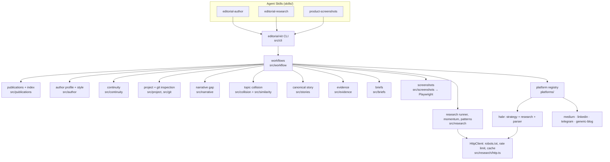

# StoryOps — Editorial Agent Suite

StoryOps helps an AI coding agent (Claude Code, Codex or any client that
supports [Agent Skills](https://agentskills.io)) turn the **real history of a
software project** into evidence-backed technical publications for Habr,
Medium, LinkedIn, Telegram and personal blogs.

It is **not** "AI writes articles automatically". It is:

```
author memory + project research + editorial research + evidence
      + screenshots + platform strategies + Agent Skills
```

The toolkit (`editorial-kit` CLI) collects, indexes, compares, checks and
scaffolds. The prose is written by the author or by an agent following the
bundled skills. Core functionality needs no paid AI APIs.

It answers:

- What actually happened in my project?
- What have I already told readers?
- What important part of the story is still missing?
- What evidence proves it?
- How should this story be told on this platform today?

and deliberately not "what trending topic can I pretend my project is about?".

## Core model

```
                 AUTHOR HISTORY
                       │
                 AUTHOR MEMORY
                       │
PROJECT REPOSITORY ────┼──── CURRENT PLATFORM RESEARCH
       │               │              │
 PROJECT HISTORY   CONTINUITY     TREND PATTERNS
       └───────────────┼──────────────┘
                 NARRATIVE GAP
                       │
                CANONICAL STORY      ← WHAT happened (one source of truth)
          ┌────────────┼────────────┐
       EVIDENCE    SCREENSHOTS   ARTICLE BRIEF
          └────────────┼────────────┘
               PLATFORM STRATEGY     ← HOW to tell it
       ┌───────────────┼─────────────────┐
      HABR          LINKEDIN          TELEGRAM …
```

**Canonical story → platform adaptation.** `articles/<slug>/story.json` holds
what happened, with evidence references. Every platform output is written from
the story, never from another platform's output. Repurposing means re-reading
the story and applying a different strategy, not summarising the Habr article.

Priority model, enforced in briefs and skills:

```
FACTUAL TRUTH > AUTHOR VOICE > NARRATIVE CONTINUITY > PLATFORM STRATEGY > CURRENT TREND PATTERNS
```

Trend research is advisory: it may influence packaging (headline, opening,
density, structure, length), never the topic or the facts.

## Installation

Requirements: Node.js ≥ 20.10, npm, git. Chromium for screenshots.

```bash
git clone https://github.com/zinverno/storyops.git
cd storyops
npm install
npm run build
npm link                      # optional: puts `editorial-kit` on your PATH
editorial-kit --help          # or: node dist/src/cli/index.js --help
```

Screenshots use Playwright:

```bash
npx playwright install chromium          # downloads Playwright's Chromium build
# or point to an existing Chromium/Chrome:
export EDITORIAL_CHROMIUM_PATH=/path/to/chrome
editorial-kit doctor --browser           # verifies a real launch
```

### Installing the Agent Skills

The skills live in `skills/` and follow the [Agent Skills specification](https://agentskills.io/specification)
(`SKILL.md` with `name`/`description` frontmatter, `references/` loaded on demand).
Skill folders are self-contained; copy or link them where your client looks for skills:

| Client | Project scope | User (global) scope | Source |
| --- | --- | --- | --- |
| Claude Code | `<project>/.claude/skills/<name>/` | `~/.claude/skills/<name>/` | [Claude Code skills docs](https://code.claude.com/docs/en/skills) |
| Codex | `<project>/.agents/skills/<name>/` | `$CODEX_HOME/skills/<name>/` (default `~/.codex/skills/<name>/`) | [Codex skills docs](https://developers.openai.com/codex/skills) ¹ |
| Other clients | see the client's docs | | use `--target` |

¹ The Codex docs page could not be fetched from the environment where this
repository was built. The user location follows `CODEX_HOME` (default
`~/.codex`), which is also where the `skill-installer` skill in
[openai/skills](https://github.com/openai/skills) installs (`$CODEX_HOME/skills`);
the repository-local `.agents/skills` location comes from secondary sources
quoting the docs. Check both against the current OpenAI docs.

```bash
editorial-kit skills install --agent claude                 # → ./.claude/skills
editorial-kit skills install --agent claude --scope user    # → ~/.claude/skills
editorial-kit skills install --agent codex                  # → ./.agents/skills
editorial-kit skills install --agent codex --scope user     # → $CODEX_HOME/skills, default ~/.codex/skills
editorial-kit skills install --target /any/skills/dir --link   # explicit target wins; symlink instead of copy
```

Nothing is installed implicitly; the command refuses to overwrite existing
skills without `--force`. Validate with the bundled validator or the reference one:

```bash
editorial-kit skills validate
pip install skills-ref && agentskills validate skills/editorial-author   # reference validator (CLI name: agentskills)
```

The skills call the `editorial-kit` CLI. They do not hardcode client-specific paths.

## Quick start

```bash
mkdir my-editorial && cd my-editorial
editorial-kit init --author "Имя Фамилия" --habr https://habr.com/ru/users/<username>/
# edit editorial.config.json: add your project under "projects" (path, aliases, glossary)
editorial-kit doctor

editorial-kit author sync                                   # Habr publications (public pages, cached)
editorial-kit author import telegram-post.md -p telegram    # other platforms: Markdown + frontmatter
editorial-kit continuity                                    # .editorial/continuity.md

editorial-kit research -p habr                              # dated, advisory trend snapshot
editorial-kit project inspect                               # repository report
editorial-kit gap                                           # narrative gap
editorial-kit collision -t "Рабочая тема"

editorial-kit story create -t "Тема" --slug my-story        # canonical story skeleton
#   → fill story.json from evidence (the editorial-author skill does this with you)
editorial-kit evidence -s articles/my-story/story.json
editorial-kit brief -s articles/my-story/story.json -p habr

editorial-kit screenshots plan -s articles/my-story/story.json --base-url http://localhost:3000
editorial-kit screenshots capture --plan articles/my-story/screenshot-plan.json

editorial-kit repurpose articles/my-story/story.json -p habr --type architecture-deep-dive
editorial-kit repurpose articles/my-story/story.json -p telegram
editorial-kit style articles/my-story/outputs/habr.md
```

`editorial-kit create -t "Тема" -p habr` runs story + evidence + brief + draft
workspace in one step.

### Offline demo

```bash
editorial-kit demo --out editorial-demo
```

Builds a fictional project repository with scripted git history, "syncs" two
Habr articles and imports a Telegram post (from fixtures, through the real
adapter with a seeded cache), researches a fixture Habr weekly sample, and
produces the continuity map, narrative gap, topic collision, canonical story,
evidence, briefs and four platform draft workspaces. No network, fixed clock.
The same scenario is the end-to-end test (`tests/e2e-demo.test.ts`). Its summary (`DEMO.md`):

- **Already covered:** project origin; original ("one-off audit") architecture.
- **Narrative gap:** architecture evolved (audit → health model, findings, knowledge analysis, SQLite storage); new subsystems not yet discussed.
- **Topic collision:** the generic "AI in my project" angle is saturated in the sample.
- **Unique contribution:** the architecture evolution, backed by code, tests and an ADR.
- **Trend observation:** higher-momentum articles in the sample expose the technical conflict early.
- **Packaging:** begin from the old architecture's limitation; do not reintroduce the project from zero.

## Architecture



| Directory | Responsibility |
| --- | --- |
| `skills/` | Agent Skills: `SKILL.md` (when, workflow, decisions, failure behaviour) + `references/` |
| `platforms/` | `schema.ts` (strategy contract), `registry.ts`, one folder per platform |
| `src/config` | validated configuration (zod) |
| `src/publications`, `src/author` | publication model, import, index, author profile, style profiles |
| `src/continuity` | continuity map (json + md) |
| `src/project`, `src/git` | read-only repository inspection, commit classification |
| `src/narrative` | narrative gap |
| `src/similarity`, `src/collision` | TF-IDF/BM25/cosine/Jaccard; topic collision |
| `src/research` | HTTP client, cache, robots.txt, momentum, structure features, patterns, snapshots |
| `src/stories`, `src/evidence`, `src/briefs` | canonical story, evidence mapping, briefs |
| `src/screenshots` | plans, Playwright capture, privacy scan |
| `src/platforms` | draft-workspace renderer shared by strategies |
| `src/workflow`, `src/cli`, `src/demo` | orchestration, CLI, offline demo |
| `fixtures/`, `tests/` | offline fixtures and tests |

Adding a platform = strategy + optional research adapter + optional renderer
(see [platforms/README.md](platforms/README.md)). Nothing in author memory,
continuity, project research, narrative gap, stories, evidence or screenshots changes.

## Platform support

| Platform | Strategy | Live research | Author history | Output (draft workspace) |
| --- | --- | --- | --- | --- |
| Habr | yes | yes (public top lists + articles; fixture-tested, not live-verified here²) | yes (public profile) | yes |
| Medium | yes | no ("live research unsupported") | manual import | yes |
| LinkedIn | yes | no ("live research unsupported") | manual import | yes |
| Telegram | yes | no ("live research unsupported") | manual import | yes (custom renderer) |
| Generic blog | yes | n/a | manual import | yes |

² habr.com was not reachable from the environment where the adapter was
written, so the live path is covered only by fixture tests of hand-written
markup that approximates Habr's pages. Run `editorial-kit research -p habr --verbose`
and check parser warnings before relying on it.

"Output" means a platform-specific draft workspace: frontmatter, constraints,
length target and, per section, its purpose and the canonical-story facts it
may use. The agent or author writes the text. Automatic publishing is out of scope.

## Generated artifacts

```
.editorial/
├── author-profile.json / .md     author memory (derived + manual voice section)      commit
├── publications/<platform>/*.json one file per publication                           commit
├── publications/index.json       deterministic publication index                     commit
├── continuity.json / .md          cross-platform continuity map                      commit
├── projects/<id>/report.*         project inspection report                          optional
├── projects/<id>/narrative-gap.*  narrative gap                                      optional
├── research/<date>/<platform>.*   dated research snapshots (metadata only)           optional
├── stories/index.json             registry of canonical stories                      commit
└── cache/                         HTTP cache (raw public pages)                      DO NOT commit
articles/<slug>/
├── story.json                     canonical story                                     commit
├── brief.md, briefs/<platform>.*  briefs                                              commit
├── evidence.md / .json            claim → evidence map                                commit
├── research/                      author context, collision, platform snapshot copy   commit
├── screenshot-plan.json / .md     screenshot plan                                     commit
├── images/originals/              canonical screenshots (never overwritten)           commit
├── images/outputs/<platform>/     platform-specific derivatives                       commit
└── outputs/<platform>.md          platform drafts                                     commit
```

`editorial-kit init` adds `.env*` and `.editorial/cache/` to `.gitignore`.
Every schema (`CanonicalStory`, `PlatformStrategy`, `Publication`,
`EvidenceRecord`, `ResearchSnapshot`, `ScreenshotPlan`, config, index,
continuity, reports) carries a `schemaVersion` for future migrations.

## Research ethics and safety

- Public pages only; robots.txt is honoured and cannot be disabled, including for every redirect hop
  (at most 5 redirects, each checked against the target origin's robots.txt and rate limit); ≥ 1 s per-host delay
  (default 2 s), concurrency ≤ 4 (default 2), timeouts, caching with TTL, `--refresh`, `--offline`.
- 401/403/anti-bot challenges stop the request. No authentication, paywall or private-API bypass.
- Research snapshots keep metadata, numbers and abstract features only; never article text.
- Momentum is a documented heuristic, not a quality score or a prediction.
- Evidence collection and project inspection skip secret-like paths (`.env`, keys,
  credentials); logs and excerpts pass through secret redaction; screenshot launch
  commands are logged without argument or environment values.
- Screenshots are blocked when **DOM text or form values** contain secret-like
  strings or unmasked emails. Pixels are not inspected (no OCR): text inside
  images, canvas, video, CSS backgrounds and iframes is invisible to the scan.
  Such elements are counted in `images/manifest.json`, and every image is marked
  `"visualReview": "required"` until a human or agent has looked at it.

## Development

```bash
npm run lint        # eslint (typescript-eslint)
npm run typecheck   # tsc --noEmit (src, platforms, tests)
npm run build       # tsc → dist/
npm test            # vitest (offline; network is blocked in tests/setup.ts)
npm run check       # lint + typecheck + build + test + skills validation
```

Tests use fixtures only. Screenshot tests start a local static server and need a
Chromium build (they are skipped, with a warning, when none is found).

## Limitations

- External HTML changes: Habr selectors live in `platforms/habr/selectors.ts` and
  will need updates when the markup changes. The parser degrades field by field
  and reports warnings instead of failing.
- The Habr live path has not been verified against habr.com from the build environment (see ²).
- Trend metrics are imperfect: top lists are biased samples, views are rounded,
  momentum is a heuristic, lexical feature detection misclassifies.
- Current trends are advisory; small samples are labelled as such.
- Medium, LinkedIn and Telegram have no live research (public access is either
  unavailable or lacks the signals needed); author history for them is manual import.
- Index, continuity and narrative gap are deterministic heuristics (keyword
  patterns, stems, glossary). They produce leads to verify; fields they cannot
  decide are marked `unresolved` for the agent.
- Screenshots need a runnable product and a Chromium build. The privacy scan covers DOM text and form values only;
  visual review of every image remains mandatory.
- Electron capture is implemented behind the same interface but **experimental
  and untested** (no Electron app in the test suite).
- No automatic publishing in v1.

## Deferred (not in v1)

Automatic publishing (Habr, LinkedIn, Telegram), platform authentication
management, engagement prediction, SEO guarantees, autonomous topic farming,
scraping protected content, AI-generated screenshots, automatic comments.
Extension points exist for embeddings/semantic clustering, LLM-assisted story
extraction, diagrams, social cards, carousels and demo videos
(`images/outputs/<platform>/` keeps derivatives separate from originals).

## License

MIT
