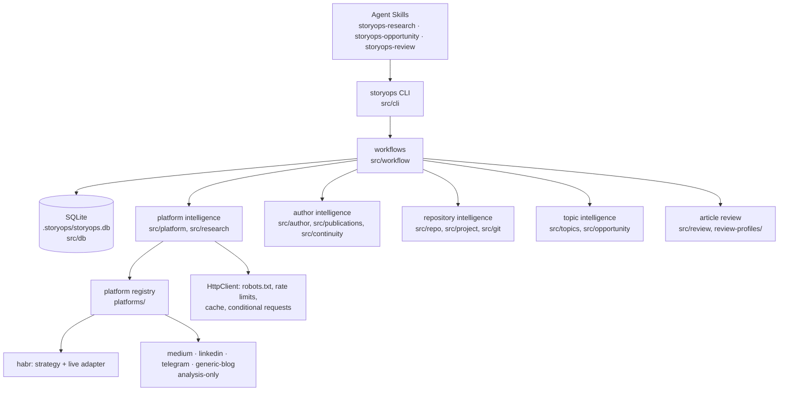

# StoryOps

**Research and review for technical authors.**

StoryOps helps technical authors decide what is worth writing about and review
what they wrote. It researches platforms, mines the author's own software
repository for real engineering changes, maps what the author has already
published, and reviews a finished human-written article read-only.

> **StoryOps analyses. The human writes.**
> StoryOps does not write articles.

It answers:

- What is happening on this platform? Which topics are crowded or underexplored?
- What has this author already written, and how deeply?
- What interesting things happened in this repository?
- Where do repository novelty and platform interest intersect?
- What problems exist in the article the human wrote?

It deliberately does not answer "what article should I write for you?", "can
you write the article?" or "can you rewrite the whole article?".

## What StoryOps is

- **Platform intelligence**: dated research samples (live for Habr, imported
  datasets elsewhere) accumulated in a local SQLite database: topic landscape,
  topic saturation with its dimensions, trend direction over time, structural
  patterns of high-momentum articles.
- **Author intelligence**: the author's publication archive and a coverage map
  (mentioned / covered / deeply covered / revisited / possibly outdated),
  duplicate-topic detection.
- **Repository intelligence**: engineering events (new subsystems, removals,
  migrations, bug fixes, state-model changes, ADRs…) with evidence strength,
  mapped to topics.
- **Topic intelligence**: opportunity reports that keep every dimension
  separate (novelty, evidence, overlap, activity, saturation, trend,
  specificity, recency), topic dossiers and side-by-side comparisons.
- **Article review**: selected language patterns (Russian first), style
  patterns, logic hints, factual claims vs. repository evidence, repetition,
  structure, clarity, platform fit and overlap with the author's archive.
  Read-only; findings with at most one short local alternative. With the
  `storyops-review` skill the agent adds a mandatory language/logic pass under
  the same rules.

## What StoryOps is not

Not an AI article generator, not an "AI writer", not an editorial author, not
a content-generation system. It does not draft articles or sections, write
introductions or conclusions, complete unfinished prose, rewrite articles,
repurpose one article into another platform, produce final copy, imitate the
author's voice or rank topics for the author. It does not create publication
assets (screenshots, images, covers). It has no virality predictions,
quality scores, predicted views or engagement forecasts, and no "AI detector".

## Workflow

```bash
storyops research platform habr                    # platform history (repeat weekly)
storyops author sync                               # the author's archive
storyops repo inspect --repo my-project            # engineering events
storyops topics discover --repo my-project --platform habr
#   → topics/opportunities.md — the author selects a topic
storyops topics show reconciliation                # topics/reconciliation/dossier.md
#   → the author writes article.md independently
storyops review article.md --repo my-project --platform habr
#   → reviews/article-<date>/review.md — the author decides what to change
```

StoryOps stays out of the way between the dossier and the review unless the
author asks a research question.

## Installation

Requirements: Node.js ≥ 20.19 (Node 20 and 22 are tested in CI), npm, git.
The database engine is [sql.js](https://sql.js.org) (SQLite compiled to
WebAssembly): no native build, identical on Node 20 and 22, and the file is a
regular SQLite database any `sqlite3` tool can open.

```bash
git clone https://github.com/zinverno/storyops.git
cd storyops
npm install
npm run build
npm link                      # optional: puts `storyops` on your PATH
storyops --help               # or: node dist/src/cli/index.js --help
```

No browser is needed.

### Agent Skills

| Skill | Purpose |
| --- | --- |
| `storyops-research` | platform research, trends, saturation, patterns, author history and coverage |
| `storyops-opportunity` | repository inspection, events, overlap with the archive, opportunity reports, dossiers |
| `storyops-review` | read-only review of a human-written article (CLI report + mandatory agent language/logic pass); never rewrites it |

All three skills refuse to write articles: asked to, they answer
*"I can research the topic, show evidence and review a draft you write."*
Skills follow the [Agent Skills specification](https://agentskills.io/specification).

| Client | Project scope | User (global) scope | Source |
| --- | --- | --- | --- |
| Claude Code | `<project>/.claude/skills/<name>/` | `~/.claude/skills/<name>/` | [Claude Code skills docs](https://code.claude.com/docs/en/skills) |
| Codex | `<project>/.agents/skills/<name>/` | `$HOME/.agents/skills/<name>/` | [Codex skills docs](https://developers.openai.com/codex/skills) |
| Other clients | see the client's docs | | use `--target` |

```bash
storyops skills install --agent claude                 # → ./.claude/skills
storyops skills install --agent codex --scope user     # → ~/.agents/skills
storyops skills install --target /any/skills/dir --link
storyops skills validate
```

Nothing is installed implicitly; existing skills are not overwritten without
`--force`. `$CODEX_HOME/skills` is only used when passed explicitly with `--target`.

## Quick start

```bash
mkdir my-workspace && cd my-workspace
storyops init --author "Имя Фамилия" --habr https://habr.com/ru/users/<username>/
# edit storyops.config.json: add your repository under "projects" (id, name, path, glossary)
storyops doctor
```

A project glossary entry becomes a **project topic**; `related` links it to
built-in platform themes, e.g.
`{ "term": "квитанции сверки", "id": "reconciliation", "aliases": ["reconciliation", "receipts"], "related": ["databases"] }`.
See [examples/storyops.config.example.json](examples/storyops.config.example.json).

### Offline demo

```bash
storyops demo --out storyops-demo
```

Fixture platform history (three imported weeks plus one run of the real Habr
adapter over cached fixture pages), a fixture author archive, and a fixture
repository with real git history → topic opportunities → a fictional
**human-written** article → review. No network, fixed clock, no article is
generated. The expected result (`DEMO.md`):

- Repository: new reconciliation subsystem (strong evidence) and a bug fix.
- Author archive: reconciliation not covered; the old "one-off audit"
  architecture deeply covered and possibly outdated.
- Platform: the generic AI framing is highly saturated and rising; the related
  database theme is moderately active.
- Opportunities: reconciliation = high repository novelty, no overlap, medium
  activity; the "AI in my pet project" angle = crowded/repetitive. No ranking.
- Review: flags the unsupported "3× faster" claim, the duplicated paragraph and
  the awkward phrase «Данная система позволяет осуществлять анализ» (possible
  local alternative «Система анализирует»); `article.md` is byte-identical.

The same scenario is the end-to-end test (`tests/e2e-demo.test.ts`).

## Architecture

```text
                         STORYOPS
                            │
             ┌──────────────┴──────────────┐
             │                             │
        DISCOVERY                      REVIEW
             │                             │
    Platform research                User-written article
    Author archive                         │
    Repository history          language · style · logic · facts
             │                  repetition · structure · clarity
      Topic landscape              platform fit · archive overlap
             │                             │
     Opportunity mining                    │
             └──────────► HUMAN ◄──────────┘
                            │
                     writes the article
```



| Directory | Responsibility |
| --- | --- |
| `src/db` | sql.js wrapper, versioned SQL migrations (`src/db/migrations/NNN-*.sql`) |
| `src/research`, `src/platform`, `platforms/` | collection (HTTP, robots, cache, Habr parser), research-run store, analytics (saturation, trends, patterns) |
| `src/topics` | built-in taxonomy, deterministic matching, saturation and trend direction |
| `src/author`, `src/publications`, `src/continuity` | archive, coverage map, author profile, continuity map |
| `src/repo`, `src/project`, `src/git` | read-only inspection, event extraction, repository topic map |
| `src/opportunity` | opportunity discovery, matrix, dossiers, comparison |
| `src/review` | read-only review: checks, review profiles, findings store |
| `src/workflow`, `src/cli`, `src/demo` | orchestration, CLI, offline demo |
| `skills/`, `review-profiles/` | Agent Skills; built-in review profiles |
| `fixtures/`, `tests/` | offline fixtures and tests |

## Platform intelligence

`storyops research platform habr` collects a dated sample (top lists per
period/hub). Each run is stored; an article seen again is **one** article with
a new metric observation; abstract features are stored once and rewritten only
when their hash changes; article bodies whose features are stored are not
downloaded again; stale cache entries are revalidated with ETag/Last-Modified.
Stored per article: metadata (platform, id, URL, title, author, time,
hubs/tags), metrics (views, rating, votes, comments, bookmarks, reading time)
and abstract features (heading count/density, intro length, code, images,
diagrams, list/quote density, first-person, conflict-first, number/question
headline, before/after, postmortem, tutorial, architecture framing). Never
article text.

```bash
storyops research history
storyops trends --platform habr --period 30d
storyops trends history "AI agents"               # buckets, shares, comparison window
storyops saturation --platform habr --topic "AI agents"
storyops patterns --platform habr
storyops research import dataset.json             # platforms without live research
```

**Saturation** reports its dimensions — article share, recent count, distinct
authors, growth vs the previous window, headline repetition, top-author
concentration, average age, momentum distribution — and a state from
explicit rules (first match wins; thresholds in `analysis.saturation`):
`insufficient-data` (< 15 articles in the window), `highly-saturated`
(share ≥ 30%), `crowded` (≥ 15%), `emerging` (≥ 2 articles, < 10%, growth
≥ +50%), `active` (≥ 5% or ≥ 4 articles), `sparse`. Each state says why:

```text
AI / LLM (general framing): highly-saturated — 23 of 71 articles (32.4%) in the window; 23 distinct authors
```

**Trend direction** (`rising`, `stable`, `declining`, `insufficient-history`)
compares the pooled share of the later half of the `analysis.trends.windowDays`
buckets with the earlier half (±20% relative and ≥ 2 points absolute), with at
least 3 usable buckets and 4 topic articles. Reports always show the time
range, sample size and comparison window, and imply no cause.

**Pattern report**: observed pattern, where observed, strength, sample size,
change over time, example article URLs, possible relevance — and "decision:
left to the author". Patterns are never applied to an article, and other
authors' titles, openings or phrasing are never reused. Popularity is never
treated as quality.

## Repository intelligence

```bash
storyops repo inspect --repo my-project
storyops repo events --since 2026-01-01 --type bug-fix,migration
storyops repo topics
```

Inputs: git commits, tags, changelog, README, architecture docs, ADRs, tests,
benchmarks and the source tree (read-only; secret-like paths are skipped).
Events: new-subsystem, removed-subsystem, failed-approach, large-refactor,
migration, bug-fix, architecture-split, state-model-change, performance-work,
new-persistence-layer, api-redesign, testing-strategy-change, security-fix,
new-integration, feature-reversal, limitation-discovered,
architecture-decision, release. Each has an id, date range, type (+aspects),
summary, files, commits, evidence refs, subsystem, evidence strength with
reasons, and a **basis** (`paths`, `commit-message`, `docs`, `tags`). Types
inferred from a commit message alone stay weak and are presented as hints.

## Topic opportunities

```bash
storyops topics discover --repo my-project --platform habr   # topics/opportunities.{md,json}
storyops topics show <candidate-id>                          # topics/<id>/dossier.{md,json}
storyops topics compare "reconciliation receipts" "generic AI plugin" "Recall architecture"
```

For every candidate: repository evidence, why it may be technically
interesting, what changed, archive overlap, what is already covered and what
is genuinely new, platform activity, saturation, trend, related structural
patterns, possible directions (descriptive, never titles or outlines), risks,
questions for the author and unknowns. Dimensions are never collapsed into a
score; candidates are alphabetical; the matrix is a map:

```text
                         PLATFORM ACTIVITY
                    low                high/medium
REPO NOVELTY high   niche              active opportunity
             low    low relevance      crowded/repetitive
```

## Author coverage

```bash
storyops author sync                          # Habr (public pages)
storyops author import post.md -p telegram    # other platforms: Markdown + frontmatter
storyops author coverage
storyops author overlap "reconciliation receipts"
```

```text
Topic                                Coverage
------------------------------------------------------------
аудит                                deeply covered, revisited, possibly outdated
жизненный цикл находок               briefly mentioned, possibly outdated
квитанции сверки                     not covered
```

Overlap reports the related publications, coverage depth, similar concepts and
the repository changes since then, with a plain interpretation — never a bare
cosine similarity.

## Article review

```bash
storyops review article.md                                  # works outside a workspace, too
storyops review article.md --repo my-project --platform habr --profile engineering-story
storyops findings list
storyops findings set F003 dismissed --note "intentional"
```

Output: `reviews/<article>-<date>/review.{md,json}`. The article is read once
and verified byte-identical afterwards; an output path that would touch the
article is refused.

**The CLI checks are deliberately limited.** The language checker is
deterministic and covers only selected Russian spelling, punctuation and style
patterns; logic rules are lexical hints. A CLI report is not proofreading.
When the review runs through the `storyops-review` Agent Skill, the agent must
follow the CLI report with a separate read-only pass for spelling, grammar,
awkward wording, unclear references, broken transitions and logical gaps. That
pass uses the same contract (location, possible issue, why it may matter,
suggested direction, at most one short local alternative) and never rewrites a
paragraph, section or article.

| Category | Examples |
| --- | --- |
| language | канцелярит («данная система позволяет осуществлять анализ» → possible local alternative «система анализирует»), selected frequent misspellings and punctuation patterns, repeated words, overlong sentences — not a full spelling or grammar check |
| style | clichés, repeated triads, "не X, а Y" and em-dash density, generic section openings, repeated conclusions, uniform paragraph rhythm — *style findings*, never an "AI probability" |
| logic | a statement and its negation; "гарантирует" vs "только при запуске" about the same subject (lexical heuristic) |
| factual | claims checked against benchmarks, docs, history and modules: supported, partially-supported, unsupported, contradicted, needs-human-confirmation |
| repetition | near-duplicate paragraphs (both places), repeated phrases, concepts defined twice — nothing is deleted |
| structure / clarity | long introduction, dense blocks, empty sections, heading/content mismatch, conclusion with new facts, definition after use, undefined acronyms, review-profile expectations |
| platform-fit | documented limits, typical length, structure vs sample medians, crowded topics, reused wording of researched titles — context only |
| archive | a section that substantially repeats one of the author's publications: what repeats, what is new |
| author-input | from `author-input.md`: MUST USE possibly missing, VERBATIM missing, DO NOT USE present |

Each finding has an id, category, severity (`info`, `suggestion`, `warning`,
`error` — the last reserved for clear-cut problems such as contradicted facts),
line range, excerpt, problem, why it matters, suggestion, at most one local
alternative (≤ 240 characters, one line, not much longer than the excerpt),
evidence for factual findings, and status (`open`, `accepted`, `dismissed`,
`resolved`). Decisions are remembered per article, so dismissed findings stay
dismissed. Review profiles (`review-profiles/*.yaml`, the former style
presets) describe what a reviewer expects from an engineering story, a
postmortem, a tutorial…; StoryOps never writes in those styles.

## Database

`.storyops/storyops.db` (config `database.file`). Tables: platforms,
research_runs, platform_articles, research_run_articles,
platform_article_metrics, platform_article_features, pattern_observations,
topics, platform_article_topics, trend_snapshots, authors, author_profiles,
author_publications, author_topic_coverage, repositories,
repository_snapshots, repository_events, repository_evidence,
repository_topics, topic_candidates, topic_opportunities, topic_overlap,
reviews, review_findings, review_suggestions, review_decisions; views
platform_topics and author_topics.

- Explicit, versioned migrations in `src/db/migrations/` (`001-…sql` …),
  each applied once in its own transaction and recorded with a checksum.
  An edited applied migration, or a database from a newer StoryOps, is an
  error; the schema is never recreated implicitly. A failing migration is
  rolled back and the file is left untouched.
- Before migrating an existing file, a copy goes to `.storyops/backups/`.
  Manual backup: `storyops db backup`, or copy the file while no StoryOps
  command is running (StoryOps is a single-user CLI; run one writing command
  at a time per workspace).

```bash
storyops db status     # version, pending migrations (does not migrate)
storyops db stats      # row counts
storyops db vacuum
storyops db rebuild    # recompute derived tables from stored base data
storyops db backup
```

## CLI

```text
storyops init | doctor | migrate | demo
storyops research platform <id> | author | history | import <file>
storyops trends [topic <t> | history <t>] | saturation | patterns
storyops author sync | import | coverage | topics | overlap <t> | profile | publications
storyops repo inspect | events | topics
storyops topics discover | show <id> | compare <a> <b> … | list
storyops review <article.md> | findings list | findings set <id> <status>
storyops db status | stats | vacuum | rebuild | backup
storyops platforms list | show | profiles list | show | validate
storyops skills validate | install | cache list | clear
```

Global options: `-C <dir>`, `-c <config>`, `--json`, `-v`, `-q`,
`--log-format json`. Common filters: `--platform`, `--period 30d`, `--topic`,
`--since`, `--refresh`, `--offline`, `--repo`, `--limit`.

## Generated artifacts

```text
storyops.config.json
.storyops/
├── storyops.db              intelligence database                 commit or back up
├── cache/                   HTTP cache of public pages            do not commit
├── research/<date>/         dated research reports
├── author/                  coverage, continuity, author profile
├── repos/<id>/              inspection report, events, topic map
├── reports/                 trends, saturation, patterns
├── review-profiles/         workspace review profiles (optional)
└── backups/                 pre-migration database copies         do not commit
topics/
├── opportunities.{md,json}
├── comparison.{md,json}
└── <topic-id>/dossier.{md,json}
reviews/
└── <article>-<date>/review.{md,json}
```

StoryOps writes only analytical reports, dossiers, reviews and its database.
There is no generated article, draft or publication-asset (images,
screenshots) directory.

## Privacy and research ethics

- Public pages only; robots.txt is honoured (every redirect hop included);
  ≥ 1 s per-host delay (default 2 s), concurrency ≤ 4; caching with TTL,
  `--refresh`, `--offline`; 401/403 and anti-bot challenges stop the request.
  No authentication, paywall, anti-bot or private-API bypass.
- Raw fetched HTML lives only in the cache. The database stores metadata,
  metrics, abstract features, topic labels and history — never other authors'
  article text.
- Repository analysis skips `.env`, keys, credentials and other secret-like
  paths; logs and excerpts pass through secret redaction; review excerpts are
  short.

## Platform support

| Platform | Live research | Author history | Dataset import | Review context |
| --- | --- | --- | --- | --- |
| Habr | yes (public top lists + article pages; fixture-tested¹) | yes (public profile) | yes | yes |
| Medium | no — analysis-only | manual import | yes | yes |
| LinkedIn | no — analysis-only | manual import | yes | yes |
| Telegram | no — analysis-only | manual import | yes | yes |
| Generic blog | not applicable | manual import | yes | yes |

¹ habr.com was not reachable from the environments where the adapter was
written, so the live path is covered by fixture tests of hand-written markup
that approximates Habr's pages. Run `storyops research platform habr
--verbose` and check parser warnings before relying on it. StoryOps never
fabricates platform data for platforms without a live adapter.

## Limitations

- Language checks are deterministic heuristics (dictionaries and patterns)
  for selected Russian spelling, punctuation and style patterns; they are not
  comprehensive proofreading and do not check grammar. Logic checks only surface lexically similar
  statements with opposite polarity or different guarantees. Factual checks
  compare claims with what the repository contains; they are not exhaustive.
  The `storyops-review` skill's mandatory agent pass and the author cover
  the rest; neither is guaranteed to find every problem.
- Topic matching is lexical (aliases, stems, hubs, tags); misclassification is
  possible. Clustering with embeddings is future work.
- Research samples come from platform top lists and imported datasets: a
  biased selection, not the whole platform. Momentum is a heuristic.
- Repository events are inferred from history, paths and docs; motivation and
  user impact are not visible in a repository.
- The Habr live path is fixture-tested only (see ¹).
- The database is loaded into memory and written atomically; very large
  histories will use proportionally more memory. One writing command at a
  time per workspace.
- Interactive review (`--interactive`) is not implemented; reviews are reports.

## Migration from v2

v2 (`editorial-kit`) planned and scaffolded articles; v3 does not. Run
`storyops migrate` (use `--dry-run` first): it adds `storyops.config.json`,
`.storyops/` and the database, imports publications, research snapshots,
repository reports and workspace style presets, and never deletes or rewrites
`editorial.config.json`, `.editorial/` or `articles/`. Old generated drafts
stay as user files and are not treated as published history. Analysis
commands keep deprecated aliases (`research -p`, `gap`, `collision`,
`continuity`, `project inspect`, `style`); generation commands (`repurpose`,
`create`, `story`, `brief`, `evidence`, `editorial`, `input`) and
`screenshots` (publication assets) print why they were removed and do
nothing. The `editorial-kit` executable remains an alias for one release.
Details and the full component classification:
[docs/MIGRATION-v3.md](docs/MIGRATION-v3.md).

## Development

```bash
npm run lint        # eslint (typescript-eslint)
npm run typecheck   # tsc --noEmit (src, platforms, tests)
npm run build       # tsc → dist/
npm test            # vitest (offline; network is blocked in tests/setup.ts)
npm run check       # lint + typecheck + build + test + skills + review profiles
```

Tests use fixtures only and need no browser.

## Deferred

Automatic publishing, social posting, screenshots and other publication
assets, video, demo-vault automation, browser extensions, engagement prediction, external embeddings and paid APIs are out
of scope. Interactive review and embedding-based topic clustering are
possible future work.

## License

MIT
